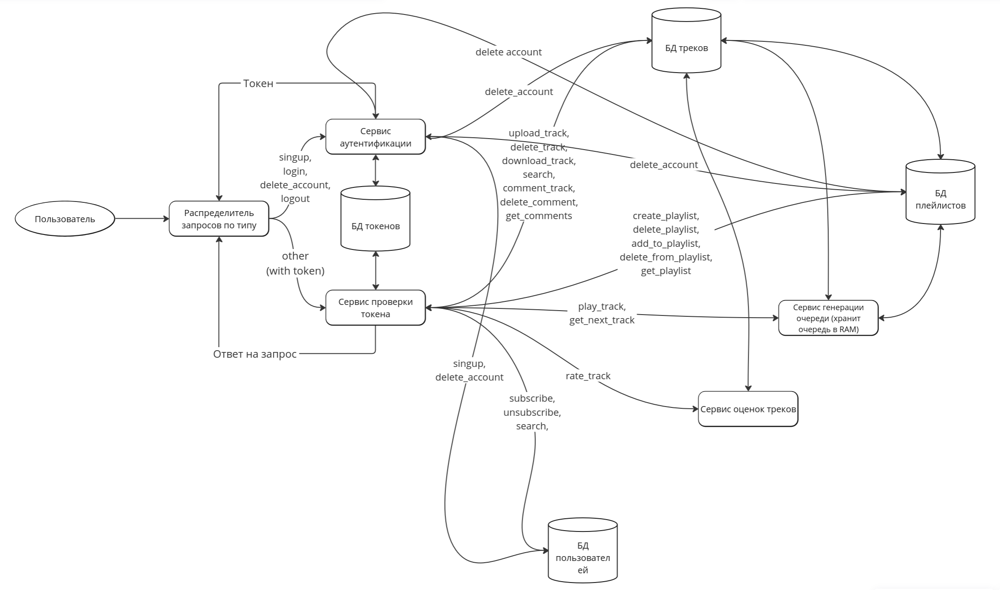

# Постановка задачи

Необходимо реализовать сервер (бэкэнд) и клиент стримингового сервиса музыки.

## Функциональные требования

### К бэкэнду:
* Доступна регистрация пользователей. Для регистрации нужны желаемый логин и пароль.
* Для аутентификации нужен логин и пароль, бэкэнд возвращает JWT токен с зашифрованными username и сроком действия.
* Доступен выход их системы (logout) по JWT-токену и удаление аккаунта по логину и паролю (для безопасности).
* Доступна загрузка пользовательских треков на сервер, каждому треку присваивается уникальный id. Также доступно удаление треков пользователем, загруженных им же.
* Доступно создание плейлистов, добавление и удаление из них треков, удаление плейлистов, получение состава плейлистов. Изменение и удаление доступно только автору плейлиста.
* Доступна подписка на других пользователей, отписка.
* Доступен поиск пользователей, плейлистов и треков.
* Доступны оценки треков от 1 до 5
* Доступно написание комментариев к трекам, их удаление и получение списка комментариев к треку.
* Бэкэнд формирует очередь воспроизведения, сначала по плейлисту, из которого был запущен трек, затем по рекомендательной системе.
* У каждого пользователя плейлист 0 -- это загруженные треки, плейлист 1 -- это избранные треки (это нужно только для отображения в приложении).

### К клиенту (приложению):
* Регистрирует, логинит пользователей.
* Проигрывает музыку.
* Отображает название трека, username автора, полоску проигрывания, обложку, текст. 
* Показывает списки треков плейлиста, пользователя.
* Предоставляет поиск, показывает его результаты. Из поиска доступен переход в плейлисты и в пользователей.

## Нефункциональные требования
* Треки хранятся в виде mp3 файлов в базе данных, у каждого трека есть уникальный внутри сервиса id и теги (теги из файла, в них хранится в том числе название канала и обложка).
* Отправка треков от бэкэнда клиенту происходит по кусочкам, чтобы пользователь долго не ждал загрузки всего трека. 
* Во время проигрывания трека клиент следит за тем, сколько у него есть закэшированных треков. Должен быть полностью закэширован текущий трек, два следующих и два предыдущих в очереди (чтобы при переключении на них они начинали играть сразу же). Как только чего-то из этого не достаёт, клиент запрашивает это у бэкэнда.
* Также в кэше клиент держит очередь idшников ранее проигранных треков (чтобы её не хранил бэкэнд).
* Бэкэнд только формирует очередь воспроизведения (очередь id), удаляя из неё уже отправленные клиенту id. Если клиент хочет запросить какой-то кусочек какого-то трека, то он делает это по id трека и номеру кусочка.
* Бэкэнд следит за временем жизни JWT-токенов, перестаёт отвечать на запросы с просроченными JWT-токенами.
* Клиент сохраняет JWT-токен в память, чтобы при перезапуске приложения продолжить слать запросы с ним же.
* Клиент сам следит за недостающими кусочками трека. Кусочки фиксированного размера (допустим, по 10 секунд).
* Вместе с id трека сервер отправляет его мета-информацию.
* Сервер фактически разбит на несколько микросервисов согласно их зонам ответственности, в разделе Дизайн подробно показаны микросервисы. Клиент не знает о микросервисности сервера, он всегда работает с одним ip.

# Цель

Реализовать стриминговый сервис музыки с заявленной функциональностью.

# Дизайн



# API

## Действия с аккаунтом

#### Регистрация
```
POST /signup
body: { "username": "...", "password": "..." }
```
Статусы ответа:
- 200 если пользователя зарегистрировали.
- 409 если пользователь уже существует.

#### Аутентификация
```
POST /login
body: { "username": "...", "password": "..." }
```
Статусы ответа:
- 200 если пользователя залогинили. В заголовке ответа указан JWT-токен, который пользователь использует в дальнейшем.
- 404 если пользователя не существует 
- 403 если логин-пароль не подошли.

#### Выход из системы
```
POST /logout
Authorization: jwt_token=...
```
Статусы ответа:
- 200 если этот токен уже был разлогинен или разлогинили сейчас.
- 401 если этого токена не существовало.

#### Удаление аккаунта
```
DELETE /delete_account
body: { "username": "...", "password": "..." }
```
Статусы ответа:
- 200 если пользователя удалили.
- 404 если нет такого username
- 403 если пароль не подошёл.

## Действия с данными

#### Загрузить трек на сервер
```
POST /upload_track
Authorization: jwt_token=...
body: { "file": "file-content" }
```
Статусы ответа:
- 200 если трек принят к загрузке. В body ответа будет лежать id трека.
- 401 если токен неактуальный.

#### Удалить трек
```
DELETE /delete_track
Authorization: jwt_token=...
body: { "track_id": "..." }
```
Статусы ответа:
- 200 если всё ок.
- 401 если токен неактуальный.
- 403 если этот трек был загружен не этим пользователем.
- 404 если такого трека нет.

#### Создать плейлист
```
POST /create_playlist
Authorization: jwt_token=...
body: { "name": "..." }
```
Статусы ответа:
- 200 если всё ок. В body ответа будет лежать id плейлиста.
- 401 если токен неактуальный.

#### Удалить плейлист
```
DELETE /delete_playlist
Authorization: jwt_token=...
body: { "playlist_id": "..." }
```
Статусы ответа:
- 200 если всё ок.
- 401 если токен неактуальный.
- 403 если этот плейлист был создан не этим пользователем.
- 404 если такого плейлиста нет.

<!-- лайкнуть трек это то же самое, что добавить в плейлист 0 -->

#### Добавить в плейлист
```
POST /add_to_playlist
Authorization: jwt_token=...
body: { "playlist_id": "...", "track_id": "..." }
```
Статусы ответа:
- 200 если всё ок.
- 401 если токен неактуальный.
- 403 если этот плейлист был создан не этим пользователем.
- 404 если нет такого плейлиста либо нет такого трека.
- 409 если этот трек уже в этом плейлисте.

#### Удалить из плейлиста
```
DELETE /delete_from_playlist
Authorization: jwt_token=...
body: { "playlist_id": "...", "track_id": "..." }
```
Статусы ответа:
- 200 если всё ок.
- 401 если токен неактуальный.
- 403 если этот плейлист был создан не этим пользователем.
- 404 если нет такого плейлиста либо нет такого трека.
- 409 если этот трек и так не в этом плейлисте.

#### Получить состав плейлиста
```
GET /get_playlist?playlist_id=...&start_from=...&count=...
```
Статусы ответа:
- 200 если всё ок. В body ответа лежат треки.
- 404 если нет такого плейлиста.

#### Подписаться на пользователя
```
POST /subscribe
Authorization: jwt_token=...
body: { "username": "..." }
```
Статусы ответа:
- 200 если всё ок.
- 401 если токен неактуальный.
- 404 если нет такого пользователя.
- 409 если уже подписан.

#### Отписаться от пользователя
```
POST /unsubscribe
Authorization: jwt_token=...
body: { "username": "..." }
```
Статусы ответа:
- 200 если всё ок.
- 401 если токен неактуальный.
- 404 если нет такого пользователя.
- 409 если и так не подписан.

#### Поиск
```
GET /search?query=...&type={"users", "playlists", "tracks"}&start_from=...&count=...
```
Статусы ответа:
- 200, в body будут лежать результаты поиска по этой категории, начиная с start_from по популярности, не более count штук. 

#### Оценить трек
```
POST /rate_track
Authorization: jwt_token=...
body: { "track_id": "...", "score": {1,2,3,4,5} }
```
Статусы ответа:
- 200 если всё ок. 
- 401 если токен неактуальный.
- 404 если нет такого трека.
- 406 если score $\notin$ {1,2,3,4,5}.

#### Написать комментарий к треку
```
POST /comment_track
Authorization: jwt_token=...
body: { "track_id": "...", "comment_text": "..." }
```
Статусы ответа:
- 200 если всё ок. В ответе возвращается id комментария, уникальный в пределах этого трека.
- 401 если токен неактуальный.
- 404 если нет такого трека.

#### Удалить комментарий к треку
```
DELETE /delete_comment
Authorization: jwt_token=...
body: { "track_id": "...", "comment_id": "..." }
```
Статусы ответа:
- 200 если всё ок.
- 401 если токен неактуальный.
- 403 если коммент не этого пользователя.
- 404 если нет такого трека или коммента.

#### Получить комментарии к треку
```
GET /get_comments?track_id=...
```
Статусы ответа:
- 200, в body будут лежать результаты поиска по этой категории, начиная с start_from по популярности, не более count штук. 

## Проигрывание музыки

#### Включить трек
```
POST /play_track
Authorization: jwt_token=...
body: { "track_id": "...", {playlist_id="..."} }
```
Статусы ответа:
- 200 если всё ок.
- 404 если нет такого трека или плейлиста.

#### Получить id и метаданные следующего трека
```
GET /get_next_track
Authorization: jwt_token=...
```
Статусы ответа:
- 200 если всё ок. В body ответа будут лежать id трека и его метаданные.
- 401 если токен неактуальный.

#### Скачать кусочек трека
```
GET /download_track?track_id=...&quality=...
```
Статусы ответа:
- 200 если всё ок. В body ответа будет лежать файл. 
- 404 если нет такого трека, либо не поддерживается такое качество.
- 425 если это качество ещё не допроцессилось

# Хостинг

Будет использоваться Яндекс Облако.
